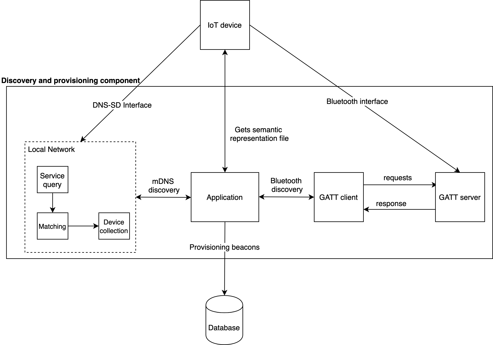
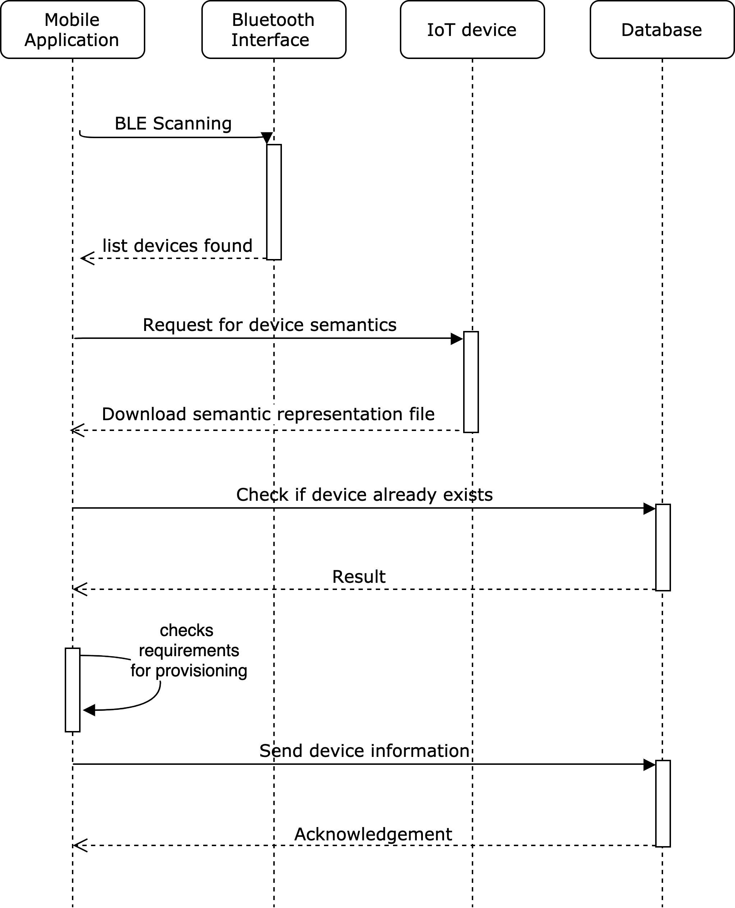
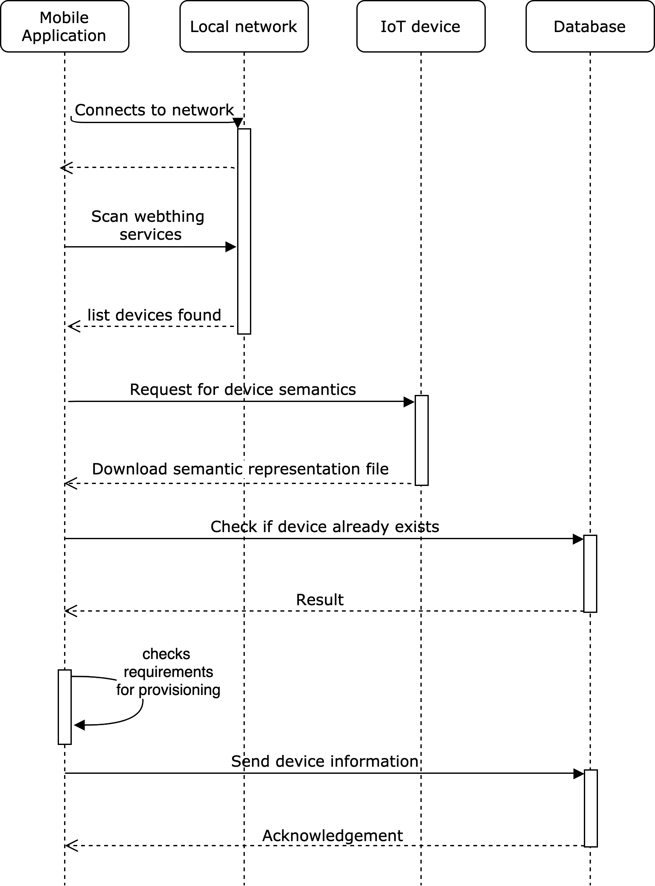

.. _P&D_internals:

===========================================
Provisioning & Discovery: Technical Details
===========================================

This document provides technical details of the Provisoning and Discovery component:

1. Description of the `P&D Component`_ 

2. Instructions about `Extending P&D to Support Additional discovery protocols`_

---------------------
P&D Component
---------------------

The provisoning & Discovery component consists of the following parts as shown in Figure 1:

- Bluetooth Low Energy Discovery 

- Domain Name Server - Service Discovery 

- Provisoning of Devices 

*Figure 1: Internal structure of the P&D Component*

BLE Interface
==============

*Figure 1: Sequence diagram of the BLE discovery*

DNS-SD Interface
================

*Figure 1: Sequence diagram of the DNS-SD discovery*

---------------------------------------------------
Extending P&D to Support Additional Protocols
---------------------------------------------------

Extending the P&D component to support additional Protocols is straightforward: simply create new python classes implementing the ``Discovery`` interface  in the root folder, and add it to the Command Line Interface `file`.

.. _file: ../src/cli.py
